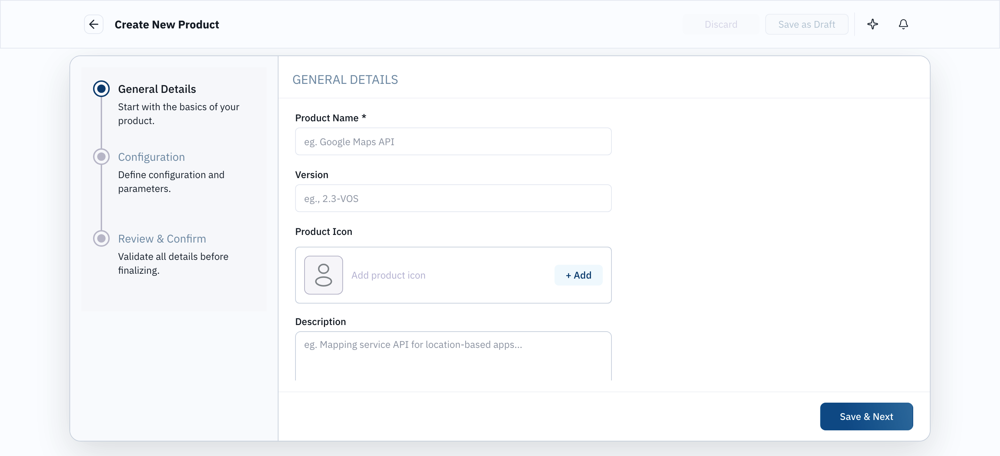
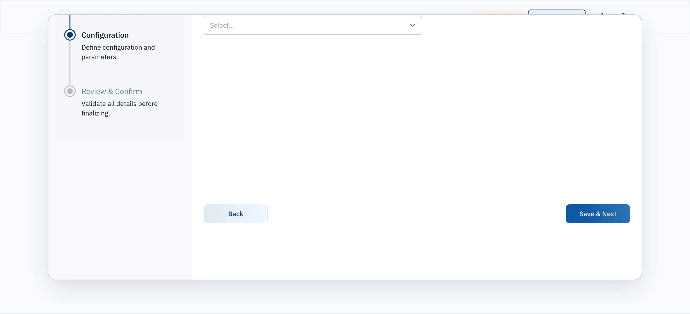
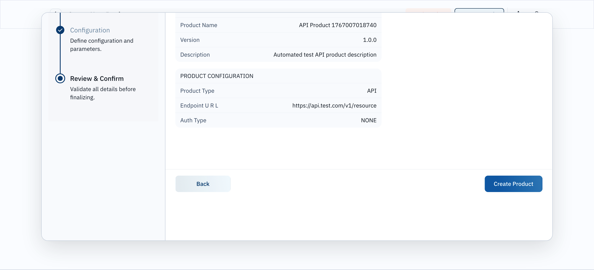

# 📸 Comprehensive Selenium Test Case Visual Report

**Module:** Product Management
**Date:** 2025-12-29
**Status:** ✅ 100% Passed

This report maps executed **Selenium Test Cases** directly to their **Visual Proof of Execution**.

---

## 🟢 1. General Details Validation

| Test Case | Description | Status |
| :--- | :--- | :--- |
| **PC-003** | Open Create Wizard | ✅ Passed |
| **PC-004** | Fill General Details (Name, Version) | ✅ Passed |

**Visual Proof:**

---

## 🟢 2. Configuration Logic (API Type)

| Test Case | Description | Status |
| :--- | :--- | :--- |
| **PC-006** | Select "API" Product Type | ✅ Passed |
| **PC-007** | dynamic "Endpoint URL" field appears | ✅ Passed |
| **PC-007** | dynamic "Auth Type" field appears | ✅ Passed |

**Visual Proof:**

---

## 🟢 3. Review & Finalization

| Test Case | Description | Status |
| :--- | :--- | :--- |
| **PC-009** | Display Review Summary | ✅ Passed |
| **PC-008** | Navigation from Step 2 to Step 3 | ✅ Passed |

**Visual Proof:**

---

## 🟢 4. Success & Creation

| Test Case | Description | Status |
| :--- | :--- | :--- |
| **PC-010** | Click "Create Product" | ✅ Passed |
| **PC-011** | Verify Success Title Display | ✅ Passed |
| **PC-012** | Redirect to Product List | ✅ Passed |

**Visual Proof:**

---

**Report Generated By:** Antigravity AI Agent
